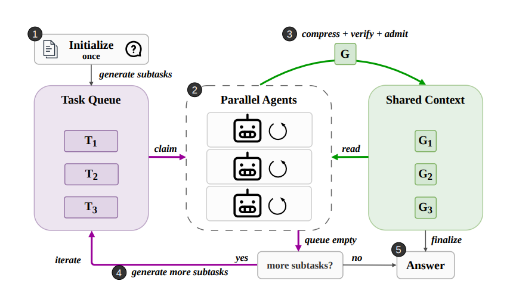
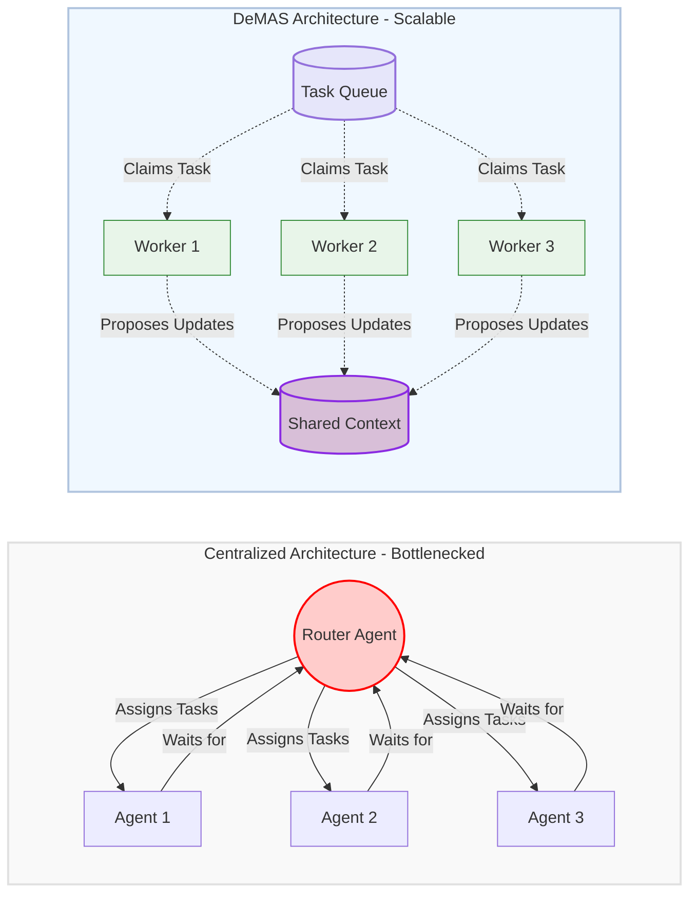
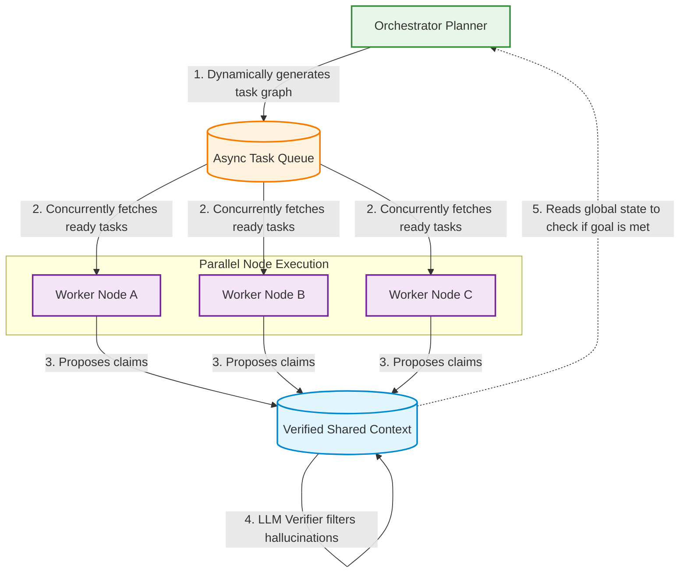

[](https://pypi.org/project/decmas/)    # <--users can test this framework 
# DeMAS: Decentralized Multi-Agent System


DeMAS is a lightweight, high-performance Python framework inspired by Stanford's research on **Decentralized Language Models (DeLM)**. It moves away from traditional "Router-Agent" bottlenecks by implementing a decentralized architecture where multiple autonomous agents operate in parallel, sharing a globally verified memory context.

## The Architecture Paradigm

*Reference Architecture from Stanford's DeLM Paper:*


### Centralized vs Decentralized
Traditional Multi-Agent Systems rely on a single Main Agent (Router) that becomes a bottleneck as it orchestrates every sub-agent. DeMAS distributes the workload across parallel agents that communicate asynchronously through a Shared Context and a Task Queue.



### The DeMAS Core Loop

DeMAS relies on three core components operating in perfect harmony. The execution loop guarantees verifiable knowledge progression without race conditions.



## Key Features

- **Decentralized Parallel Execution:** No central bottleneck. Multiple worker nodes run concurrently using standard Python threading.
- **Verified Shared Context:** Agents do not communicate directly. They propose updates to a shared memory. Updates are strictly verified by an LLM before admission, entirely eliminating downstream hallucination chains.
- **Asynchronous Task Queue:** Dynamic generation of sub-tasks by the orchestrator. Workers automatically claim ready tasks as soon as their local dependencies are resolved.
- **Native Langchain Integration:** Built entirely on `langchain-core`, allowing you to plug in OpenAI, Anthropic, Groq, or local models effortlessly.

## Installation

Install directly from PyPI:

```bash
pip install decmas
```

*(For developers: If you want to modify the framework, you can clone the repository and run `pip install -e .`)*

*Note: You must also install your preferred LLM provider, e.g., `pip install langchain-openai` or `pip install langchain-groq`.*

## Quick Start

Here is a minimal example of how to initialize the engine and run a complex goal:

```python
import os
from langchain_groq import ChatGroq
from demas import DemasOrchestrator

# Initialize your LLM
os.environ["GROQ_API_KEY"] = "your-api-key"
llm = ChatGroq(model="llama3-70b-8192", temperature=0)

# Initialize the Engine with 3 parallel workers
engine = DemasOrchestrator(llm=llm, num_workers=3)

# Pass a complex goal to the orchestrator
goal = "Research LangGraph, extract its top 3 features, and compare it with Autogen."

# Run the Framework
final_answer = engine.run(goal)
print("FINAL RESULT:", final_answer)
```

---
*Architected for next-generation Agentic AI capabilities.*
